# LVS-Gateway

A bridge to translates the Lovense BLE protocol into broadcast commands for MuSE, LoveSpouse, and Leten toys.

# Motivation

You bought a cheap vibrating toy from China that claims app support only to find out it doesn't support XToys.app/buttplug.io/etc.

# Installation & Usage

## Prerequisites

- ESP32 or ESP32-S3 development board
- USB cable
- Browser supporting Web Serial

## Installation

1. Go to https://wilaz.github.io/LVS-Gateway/
2. Plug in your ESP32 board
3. Press the [connect] button and follow the instructions

## Usage

- Place the ESP32 near the toy and power it on
- Connect to the bluetooth device named "LVS-Gateway" on your preferred control device

# FAQ

Q: Does this support XToys.app?

A: Yes, just connect a Lovense device via bluetooth

---

Q: Does this support buttplug.io?

A: Yes, same as with XToys.app

---

Q: Do you recommend buying MuSE/Lovespouse devices?

A: No, see [iostindex.com](https://iostindex.com) for an overview

---

Q: Can I control more than one device at the same time?

A: Yes, all supported devices near the ESP32 will receive the same commands.

---

Q: How do I now if this is working?

A: If it vibrates, it's working. There is no other way to tell because of the non-standard way the toys use bluetooth.

# Connectivity

```mermaid
---
title: "LVS-Gateway connectivity overview"
---
flowchart LR
	259657(("Buttplug.io")) <==>|"Lovense BLE"| 474684[["LVS-Gateway"]]
	linkStyle 0 stroke:#0000ff,fill:none
	866602(("XToys.app")) <==>|"Lovense BLE"| 474684
	linkStyle 1 stroke:#0101ff,fill:none
	474684 -.->|"BLE (broadcast only) 🛜"| 396938{"LoveSpouse compatible toy"}
	linkStyle 2 stroke:#009aff,fill:none
	474684 -.->|"BLE (broadcast only) 🛜"| 633666{"MuSE compatible toy"}
	linkStyle 3 stroke:#009aff,fill:none
```

